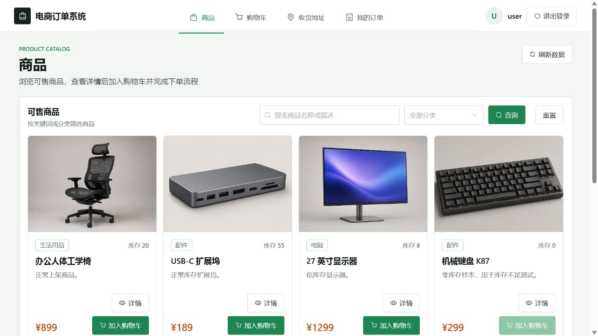
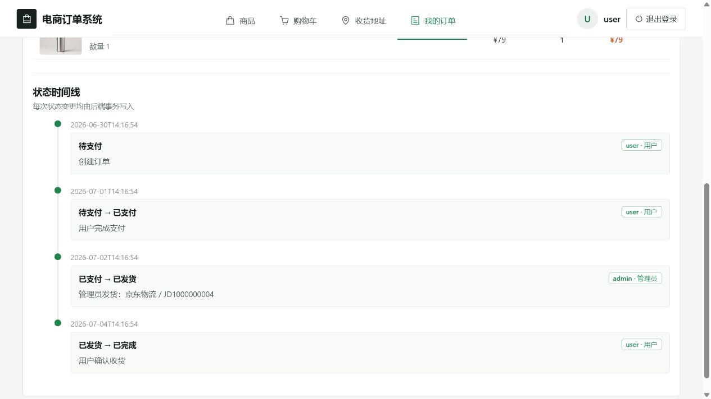
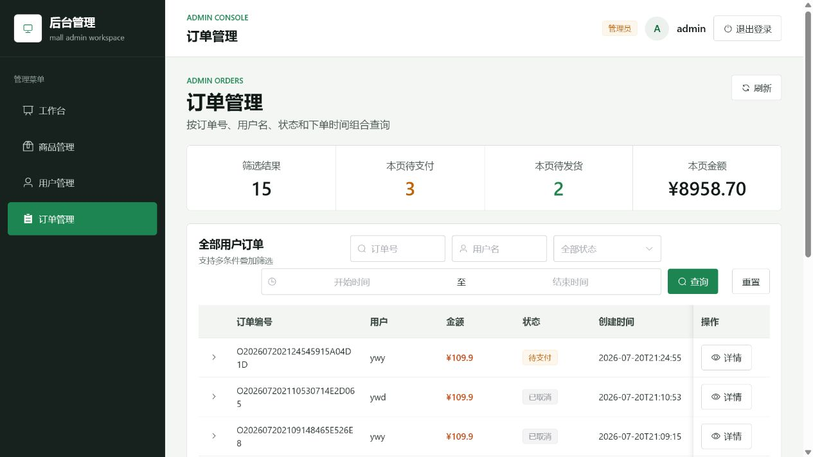

# mall-test-system V2

面向软件测试实习项目的中等复杂度电商订单管理系统。V2 保留商品、购物车和订单能力，重点增加收货地址快照、订单状态机、状态日志、权限校验、组合查询、数据库锁和软删除等可测试场景。

## 测试成果

| 验证项 | 结果 |
| --- | --- |
| 功能测试 | 116 条用例，初测 114 条通过、2 条未通过；修复后回归通过 |
| 接口测试 | 49 条用例，全部通过 |
| pytest / Allure 回归 | 17 条测试实例全部通过，通过率 100% |
| Postman / Newman 回归 | 54 个请求项、21 条核心断言，失败数 0 |
| JMeter 并发与压力验证 | 商品列表 10 线程共 100 次请求：异常率 0%、平均 21 ms、P95 33 ms、吞吐量 10.8 次/秒；两个用户并发购买库存为 1 的商品，未发生超卖 |
| 缺陷回归 | 2 个高优先级缺陷均已修复并通过回归 |

测试覆盖认证、商品、购物车、收货地址、订单状态流转、后台管理、权限控制和库存一致性。测试用例、缺陷记录、自动化脚本及完整报告见[验证资料](#验证资料)。

## 项目预览

### 用户端商品列表



### 订单状态时间线



### 管理端订单管理



## 技术栈

| 模块 | 技术 |
| --- | --- |
| 后端 | Spring Boot 2.7 + Spring MVC + Spring Data JPA |
| 前端 | Vue3 + Vite + Element Plus |
| 数据库 | MySQL 8.0 / InnoDB |
| 接口文档 | springdoc-openapi / Swagger UI |
| 部署 | Docker Compose + Nginx |

## 默认账号

| 场景 | 用户名 | 密码 | 状态 |
| --- | --- | --- | --- |
| 普通用户 | `user` | `123456` | 启用 |
| 管理员 | `admin` | `123456` | 启用 |
| 禁用登录 | `disabled_user` | `123456` | 禁用 |

表中管理员密码用于本地初始化；Docker 部署会使用 `deploy/.env` 中的 `ADMIN_PASSWORD` 覆盖它。

初始化数据还包含两个收货地址、正常/低/零库存商品、下架商品、软删除商品，以及 `CREATED`、`PAID`、`SHIPPED`、`COMPLETED`、`CANCELLED` 各一条订单。

## 启动

Docker 一键启动：

```bash
cd mall-test-system/deploy
cp .env.example .env
# 修改 .env 中的三个密码后再启动
docker compose up -d --build
```

云服务器只需公开 `80`；MySQL `3306` 和后端 `8080` 默认只绑定服务器本机。完整步骤见 [deploy/部署说明.md](deploy/部署说明.md)。

MySQL 首次启动会执行 [sql/init.sql](sql/init.sql)。已有 Docker 数据卷不会自动重放脚本；测试环境重置数据前请确认没有需要保留的数据，再执行：

```bash
cd deploy
docker compose down -v
docker compose up -d --build
```

## 鉴权与响应

登录后使用 `Authorization: Bearer {token}`。用户密码使用 BCrypt 保存；旧数据库中的明文密码会在启动时自动迁移。Docker 部署时，管理员密码由 `deploy/.env` 的 `ADMIN_PASSWORD` 设置。所有接口统一返回：

```json
{
  "code": 200,
  "message": "success",
  "data": {}
}
```

非法参数和 JSON 返回 400，未登录返回 401，无权限返回 403，资源或接口不存在返回 404。token 保存在后端内存中，服务重启后需要重新登录。

## 核心接口

| 业务场景 | 核心接口 | 说明 |
| --- | --- | --- |
| 登录与注册 | `POST /api/login`、`POST /api/register` | Token 鉴权与禁用账号校验 |
| 商品浏览 | `GET /api/products` | 关键词、分类与分页查询 |
| 购物车 | `/api/cart` | 商品添加、数量修改与删除 |
| 收货地址 | `/api/addresses` | 地址管理与唯一默认地址 |
| 用户订单 | `POST /api/orders`、`POST /api/orders/{id}/pay`、`DELETE /api/orders/{id}` | 创建、支付与取消订单 |
| 订单履约 | `POST /api/admin/orders/{id}/ship`、`POST /api/orders/{id}/confirm-receipt` | 管理员发货与用户确认收货 |
| 管理查询 | `GET /api/admin/orders`、`GET /api/statistics` | 订单组合查询与数据统计 |

完整接口、请求参数和响应模型可在后端启动后访问 Swagger UI：`http://localhost:8080/swagger-ui.html`。批量回归资料见 [Postman Collection](docs/postman_collection.json) 和 [Postman Environment](docs/postman_environment.json)。

## JMeter 并发与压力验证

[docs/并发测试.jmx](docs/并发测试.jmx) 包含两个独立线程组，使用 JMeter 5.6.3 编写：

| 场景 | 配置 | 验证目标与结果 |
| --- | --- | --- |
| 商品列表查询压力 | 10 线程、Ramp-Up 0 秒、每线程循环 10 次 | 对 `GET /api/products?page=1&size=8` 共发起 100 次请求；异常率 0%，平均响应时间 21 ms，P95 33 ms，P99 37 ms，吞吐量 10.8 次/秒。该结果仅代表本次测试环境与配置，不代表生产容量。 |
| 低库存并发下单 | 2 线程、Ramp-Up 0 秒、每线程循环 1 次、同步定时器按 2 个线程放行 | 两个不同测试账号同时购买库存为 1 的测试商品。预期一个订单创建成功、另一个返回库存不足；最终不发生超卖。 |

并发下单流程为：`CSV 测试账号 → 登录并提取 token → 新增地址并提取 addressId → 加入购物车并提取 cartId → 同步创建订单`。订单创建会扣减库存；取消 `CREATED` 订单会恢复库存。运行前应清理两个测试账号的旧购物车，并将测试商品库存恢复到预设值；运行后应取消成功创建的测试订单，避免留下业务数据。

CSV 参数文件为 [docs/信息.csv](docs/信息.csv)，其中需要提供至少两行可登录的测试账号。脚本不再固定依赖本机桌面路径；命令行运行时可显式指定 CSV 文件：

```bash
jmeter -n -t docs/并发测试.jmx -Jaccounts_csv=docs/信息.csv
```

先用“查看结果树”调试单次请求；正式压测时应禁用该监听器，主要通过“聚合报告”查看异常率、P95 和吞吐量。仅应在测试环境运行写入型并发下单场景。

## 核心规则

- `CREATED` 可以支付或取消。
- `PAID` 只能由管理员发货。
- `SHIPPED` 只能由订单所属用户确认收货。
- `PAID`、`SHIPPED`、`COMPLETED` 不能直接取消；`CANCELLED` 不能支付。
- 重复支付、取消、发货和确认收货返回明确的 400 错误。
- 状态变更使用订单悲观写锁；取消库存恢复与状态日志写入在同一事务中完成。
- 每次创建、支付、发货、完成和取消都写入 `order_status_log`。
- 订单保存收货地址快照，地址修改或删除不影响历史订单。
- 同一用户最多一个默认地址，应用层用户锁和数据库唯一约束共同保证一致性。
- 普通用户只能操作自己的地址和订单，不能访问 `/api/admin/**`。

## 验证资料

- 测试点脑图：[docs/电商订单管理系统.xmind](docs/电商订单管理系统.xmind)
- 功能测试用例：[docs/电商订单管理系统测试用例.xlsx](docs/电商订单管理系统测试用例.xlsx)
- 接口测试用例：[docs/接口测试用例.xlsx](docs/接口测试用例.xlsx)
- 缺陷记录：[docs/缺陷用例.xlsx](docs/缺陷用例.xlsx)
- Postman Collection：[docs/postman_collection.json](docs/postman_collection.json)
- Postman Environment：[docs/postman_environment.json](docs/postman_environment.json)
- Newman HTML 报告：[docs/newman-report.html](docs/newman-report.html)
- JMeter 两用户并发下单脚本：[docs/并发测试.jmx](docs/并发测试.jmx)
- JMeter CSV 参数文件：[docs/信息.csv](docs/信息.csv)
- pytest / Allure 接口自动化：[api-tests](api-tests)
- 测试总结：[docs/测试总结报告.md](docs/测试总结报告.md)

pytest 接口自动化目前包含登录、商品、购物车和订单共 17 条测试实例，覆盖参数化登录异常、Token 鉴权、动态 ID 关联、购物车数据清理，以及订单创建—查询—取消流程。Allure 报告按四个业务模块展示中文用例名称、fixture 前后置和关键接口步骤；支付、管理员发货和确认收货的完整状态流由 Postman/Newman 回归覆盖。进入 `api-tests` 安装依赖后可执行：

```bash
pip install -r requirements.txt
pytest -v
allure serve allure-results
```

后端可运行 `mvn test` 验证重复取消库存只恢复一次、已取消订单不能支付等规则；是否通过应以本机实际命令输出为准。
